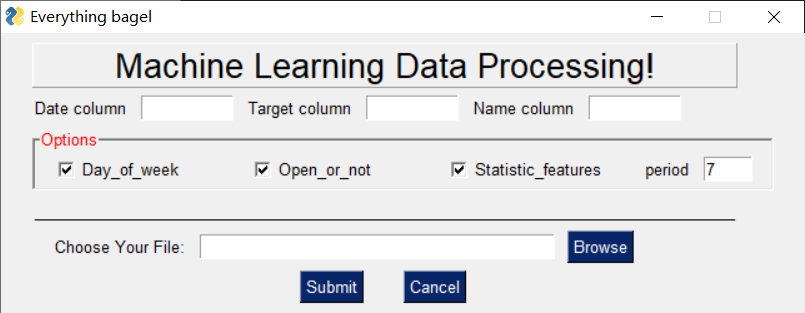

# ML_data_process
In machine learning, feature process like adding statistic features is always necessary and complicated. This project help to deal with that problem, help you get rid of Excel. By using this script/software, you can:

- Filling the missing or not record items that are not record as 0.
- Transfer the date columns to day_of_week columns.
- Add open or not columns to the data.
- Add statistic_features according your period of days.

## Usage

1. Fill the Date column, Target column, and Name column(your main feature) in you file. ※ you can open your .xlsx/.csv file to check the name.
2. Choose your options. Whether to add "Day_of_week", "Open_or_not", "Statistic_features:period" to your output file.
3. Choose your file in your computer.
4. Enter "Submit" button.

※ The example file of input and output could be seen in example folder.

## Version
- [./windows/main.exe](windows/main.exe) **command line version**
- [./windows/ml_data_process(stand_alone).exe](windows/ml_data_process(stand_alone).exe) **windows-stand_alone version**
- [./windows/ml_data_process.zip](windows/ml_data_process.zip) **windows-full version(with less bugs)**

Source code: [scripts](scripts/)

Welcome to pull requests.